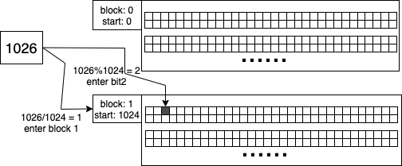

## bitmap1024

### 1. 分块位图
设想这样一个场景，我们在数据库中记录一些比较连续的消息ID，其内容如下:

| 用户ID | 会话ID | 消息ID |
| ----  | ----  | ---- |
|   1   |  101  |  1   | 
|   1   |  101  |  2   | 
|   1   |  101  |  3   | 
|   1   |  101  |  4   | 
|   1   |  101  |  5   | 
|   1   |  101  |  6   | 
|   1   |  101  |  7   | 
|   1   |  101  |  8   | 
| ...   |  ...  |  ... |
|   1   |  101  | 2000 |

从数据中可以看出用户每个会话的消息ID都是有每次加1递增的，使用位图来存储消息ID可能是不错的选择，
假如我们定义1024位为一个位图的块，则表格内容变为:

| 用户ID | 会话ID | 消息块起始ID | 消息块位图 |
| ----  | ----  | ----        | ----     |
|   1   |  101  |  0          |  位图1    |
|   1   |  101  |  1024       |  位图2    |

如果用户ID是32位整数，会话ID是64位整数，消息ID是32位整数，则2000条消息需要的容量是:
(4+8+4)*2000 = 32000个字节，约为32K。假如使用位图块的方式来存储，则2000条消息的容量是:
(4+8+4+128)*2 = 288个字节，为原来的0.9%，百分之一都不到。

1024 bit可用16个uint64组成，总共128个字节:   


在上面的例子中，如果有对应的消息ID，那消息块位图中相应的位会被置1，以第一个位图块为例子，
一个位图块可以存储1024条消息。在第一个位图块中存放了消息ID从0到1023的位图信息([0, 1023])，
可以看到除了消息ID 0没有被置位，其余的ID都置位了:    


### 2. 使用分块位图表示整数
这里先讨论非负整数的情况，对于负整数，go语言在做取模运算时与C语言一样，负数对正数取模，余数还是负数。
因为我们使用的场景中，大部分都是正整数的情况，如果以后涉及到负整数的情况，可以做一个新的整除/取模的函数，与python类似。例如(-3/2 => -1, -3%2 => -1)变为(-3/2 => -2, -3%2 => 1)，这里就不展开讨论了。

在用1024位图块表示非负整数的时候，需要先将这个数在那个块计算出来，通过n/1024可以得到其所在的块，再通过n%1024就可以得到它在此块位图中处于哪一位。

以数字1026为例(1026/1024=>1, 1026%1024=>2)，可以得出1026在索引为1的块(以0开始的第2块)，位图的位为2(以0为开始的第3位)。   


### 3. 位图的集合操作
对位图做类似集合的操作是非常容易的事情，两个位图求交就是按位与，求并就是按位或，对集合求反就是按位反。

### 4. 位图Count与访问
位图与map很类似，如果按某位去访问，复杂度为O(1)，找出位图中被置位的位数情况要复杂一些。

#### 4.1. 位图中被置1的位数的个数统计
在实现位图的时候，对位图中被置1的位数进行统计时能想到最笨的办法就是对每一位挨个检查，64位整数需要做64次。但常识告诉我们，组合有其内置的规律，应该有更取巧的方法。世界中充满了各种对称，在一道小学生的习题可以看成端倪，"4盏打开的灯，任意关掉3盏，问总共有多少种关法？"，开灯与关灯对应了光明与黑暗，其实就是一种对称，如果换成另外一个思路，这个题目就简单多了，"4盏没有打开的灯，任意打开其中一盏，问总共有多少种开法？"，如果把关3盏灯与开1盏灯看成一种对称，也能解释组合中类似C(n, k) = C(n, n-k)这样的公式了。    
64位是两个对称的32位，将2个32位中被置1的位数相加就是64位中1的个数。同理，32位是2个16位相加，16位是2个8位相加，8位是2个4位相加，4位是2个2位相加，2位是2个1位相加。总共进行log2(64)=6次运算就可以计算出来。实际上，go标准库"math/bits"中就是用了这样的方式，在注释中google工程师致敬了经典著作《Hacker's Delight》，看上去多读经典是非常有用的。

```go
// OnesCount64 returns the number of one bits ("population count") in x.
func OnesCount64(x uint64) int {
	// Implementation: Parallel summing of adjacent bits.
	// See "Hacker's Delight", Chap. 5: Counting Bits.
	// The following pattern shows the general approach:
	//
	//   x = x>>1&(m0&m) + x&(m0&m)
	//   x = x>>2&(m1&m) + x&(m1&m)
	//   x = x>>4&(m2&m) + x&(m2&m)
	//   x = x>>8&(m3&m) + x&(m3&m)
	//   x = x>>16&(m4&m) + x&(m4&m)
	//   x = x>>32&(m5&m) + x&(m5&m)
	//   return int(x)
	//
	// Masking (& operations) can be left away when there's no
	// danger that a field's sum will carry over into the next
	// field: Since the result cannot be > 64, 8 bits is enough
	// and we can ignore the masks for the shifts by 8 and up.
	// Per "Hacker's Delight", the first line can be simplified
	// more, but it saves at best one instruction, so we leave
	// it alone for clarity.
	const m = 1<<64 - 1
	x = x>>1&(m0&m) + x&(m0&m)
	x = x>>2&(m1&m) + x&(m1&m)
	x = (x>>4 + x) & (m2 & m)
	x += x >> 8
	x += x >> 16
	x += x >> 32
	return int(x) & (1<<7 - 1)
}
```

#### 4.2. 位图中被置1的位数的遍历
如果一个问题在搜索引擎中和现有的一些书籍中找到答案，那还不错，至少某种意义上来说，它不算难，也有可能它很难，但被前人攻破了。
这里对这个问题我不会做过多的阐述，事实上我现在还没有足够的把握设计出理论上比较完美的算法。
如果定义遍历64位bitmap效率的变量为： 遍历出的位数/对bitmap的按位访问次数，那现有算法的效率区间大致在15%至100%。
严格意义上说，遍历置1位的位数是一个O(N)问题，其中N是遍历出的位数，如果顺序按位访问，如果我们从最低位到最高位遍历，最坏的情况是bitmap中只有最高位被置1，需要进行64次位操作才能遍历此最高位(如果所有位都为0，情况反而简单，只需要判断此64位整数是否为0)。此时，遍历的效率相对比较低，就是1/64约为1.57%，遍历的复杂度理论上就是C*O(N)，所有的优化就是想办法优化C。   
根据位图中被置1位数的密度，可以将位图分为稀疏位图和非稀疏位图。    
假如我们以64位位图中<=9和>9来划分稀疏位图和非稀疏位图，我们先分析非稀疏位图：   
1. 非稀疏位图中至少有10位被置1，如果顺序遍历64位，肯定能获取这些被置1的位数。此时，效率C最低是15%。
2. 稀疏位图如果用顺序遍历效率会很低，极端情况就是恰好只有遍历的最后一位为1，这样效率C约为1.57%。提高稀疏位图被遍历的效率可以利用go标准库中的两个函数，它们找最高位或最低位的1的效率是O(logN)，这里N为64，logN=6，也就是说往往需要进行6次查找才能找到，其效率为1/6，约为16.7%。实际上在go标准库的算法中，它内置了一些计算结果在表中，通过查表的方式效率肯定高过1/6。

##### 4.2.1. go标准库的两个相关函数 
go标准库"math/bits"有两个有用的函数，一个是TrailingZeros64，一个是Len64。这两个函数分别用于从低位到高位找到此整数位数上第一个1的位置和从高到低找到第一1的位置，这里对这两个函数不作过多介绍，原理上是利用了分治的思想，将本来算法复杂度由O(N)变成了O(logN)。    

更神奇的是TrailingZeros64还利用了
[德·布鲁因(de Bruijn)序列](https://halfrost.com/go_s2_de_bruijn/) ,
出现在Knuth的Volume 4(代码注释有提到)，这个算法相当高级，通过查表方法让效率很高。
```go
// TrailingZeros64 returns the number of trailing zero bits in x; the result is 64 for x == 0.
func TrailingZeros64(x uint64) int {
	if x == 0 {
		return 64
	}
	// If popcount is fast, replace code below with return popcount(^x & (x - 1)).
	//
	// x & -x leaves only the right-most bit set in the word. Let k be the
	// index of that bit. Since only a single bit is set, the value is two
	// to the power of k. Multiplying by a power of two is equivalent to
	// left shifting, in this case by k bits. The de Bruijn (64 bit) constant
	// is such that all six bit, consecutive substrings are distinct.
	// Therefore, if we have a left shifted version of this constant we can
	// find by how many bits it was shifted by looking at which six bit
	// substring ended up at the top of the word.
	// (Knuth, volume 4, section 7.3.1)
	return int(deBruijn64tab[(x&-x)*deBruijn64>>(64-6)])
}
```

Len64的算法是通过二分几次后再查表来完成
```go
// Len64 returns the minimum number of bits required to represent x; the result is 0 for x == 0.
func Len64(x uint64) (n int) {
	if x >= 1<<32 {
		x >>= 32
		n = 32
	}
	if x >= 1<<16 {
		x >>= 16
		n += 16
	}
	if x >= 1<<8 {
		x >>= 8
		n += 8
	}
	return n + int(len8tab[x])
}
```

实际上，如果需要很精细地分析算法效率，则需要考虑很多场景，比如是否能利用到处理器流水，变量会在寄存器和CPU缓存中还是会放回内存，分支预测是否更合理。这里说这个的目的主要是：可能从算法性能来说，有些算法理论上应该比别的算法更有优势，但实际上并不一定比别的算法在运行时快。

##### 4.2.2. 现阶段的实现
现在对uint64的位遍历是用9作为64位位图是否是稀疏位图的一个阈值，大于9时使用顺序遍历判断；小于9的利用前面提到的TrailingZeros64或Len64函数来顺序找寻稀有的被置1的位。

##### 4.2.3. TODO
位图遍历现在实现的效率足够应付很多场景了，不过对其性能的压榨其实是个很有意思的事情。

### 5. 位图的序列化
位图的存储是很高效的，但稀疏位图除外。假如在一个1024位图中，只有1位被置位，如果直接将位图序列化，需要128个字节。但实际上它只表示了一个[0,1023]之间的整数，事实上用2字节就能表示这样一个整数了。现有的序列化策略是当1024位图中元素个数没有超过64时，用2个字节顺序存放这些数值，当超过64时，将整个位图的128个字节直接存放。

### 6. 位图的优劣
位图好处是节约存储空间，作集合运算很方便。但也有不好的地方，如果将1024位图看成一个整体，那任何一位的变化都会引发整块数据的IO操作。

### 7. 封装的两个重要数据结构
U32BitTip，它将uint32按1024为块划分，能表示的范围位uint32。   
U32BitTips为它的封装后的切片形式，主要封装了遍历切片的函数。
```go
//U32BitTip combine uint32 and 1024
type U32BitTip struct {
    Start uint32
    B1024 Bit1024
}
```

BigU32，它表示的整数范围为[0, uint32.Max*1024-1]，为4398046510079(4万亿)，是一个非常大的数，它的表示形式为int64。   
BigU32s为它的封装后的切片形式，主要封装了遍历切片的函数。
```go
//BigU32 combine uint32 and 1024
type BigU32 struct {
    Start uint32
    B1024 Bit1024
}
```
