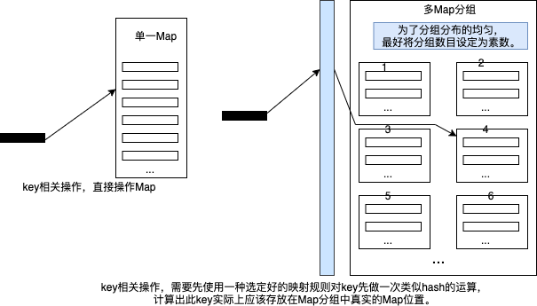

## remap用来对某些健值进行分组映射的工具函数包

在使用Map的时候，有时为了提高效率，会用一组Map来对外呈现出一个Map的行为。
举例来说，如果将用户的信息放置在一个Map中，这个Map往往会比较大，不论是在对Map本身操作，还是在涉及到操作锁相关的情况。
这种大的Map效率都不如将Map进行分组。假如我们将Map分成73组，那在进行Map操作的时候需要先对Key进行一次运算，让此Key
能够基于某种规则被映射成一个整数，再对此整数进行取模后，将其映射到对应的具体Map上。

这个包的功能就是提供这样的映射工具函数，在syncx/semap包和cache包中都会用到这些函数。事实上，这些函数除了可以在对Map进行分组时使用，
也可以对别的资源进行分组时使用，例如如果有一组工作go routine专门处理一些事务，将一个具体的工作或事务分配到某一个工作go routine(工作线程)时，
也可以使用类似的分组方式。

### 特别说明

在对Map相关的分组测试后，对Map或Map为入口的并发控制，分组效率比不分组提升1倍以上。但由于本身Map操作和加解锁的过程耗时很低，
实际上对系统效率的提升不是太显著。不分组的Map耗时可能在500ns，分组的Map耗时在200ns左右，虽然效率提升，但因为基数低，也就是提示了
300ns左右的时间。在大部分时候，使用不分组和分组都行，如果要追求极致的高性能，分组是不错的选择。

