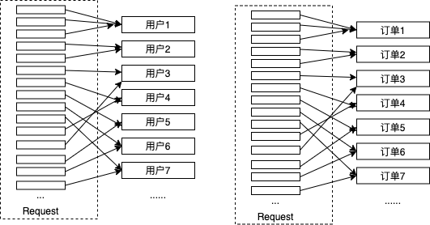
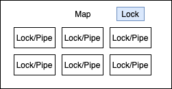

## semap解决gRPC中多请求的排队问题

### 问题来源

在以前的项目中，通过channel的方式做了一些串行化的封装。根本原因是gRPC服务器在处理请求时会启动专门的go routine
来处理请求，很多时候我们需要这些请求能够按照与业务场景相关的一些顺序来执行，
不论是使用channel或锁，都需要做一些并发控制。
例如，在下图中，针对用户/订单相关的操作，大部分时候都需要顺序执行或者加锁。


### 放置锁的容器与锁粒度

在go语言中，用Map来存放这类的go routine顺序控制(串行化)相关信息是比较合适的，以前这类问题的实现与解决方案
就如下图所示，用Map存放这些控制器，整个Map有一个全局的锁，各个控制器又有自己独立的锁。在以某个key为键值获取锁
或进行串行化等待时，先使用Map的全局锁，在Map中查找是否有相应的key，如果没有则创建相应的控制器，然后释放Map的
全局锁，然后再针对控制器进行加锁或串行化排队。


这种方式最大的问题是Map是需要限定长度的，因为内存毕竟有限，很多时候需要删除Map中的一些控制器，在以前的实现中，
使用了LRU Map来保存控制器，但控制器删除过程极其复杂，而且还有很多临界条件没有处理好。事实上，因为Map有它自己
的全局锁，各个控制器也有自己的锁或排队队列，要在两个不同的同步相关变量间做协调基本上是不可能完成的任务。设想一下，
在这种情况下，如何在控制器释放锁的时候检查是否能释放(删除)Map中对应的key？这种情况下，是先对Map加锁，还是对控制器加锁？
Map的全局锁和控制器的锁总有一个会在另外一个之前加锁，也总有一个会在另外一个之前释放，如果在这两者之间产生了相关的同步事件，
如何协作呢？这两种锁会让问题变得更复杂，甚至会产生死锁。

### 问题的简化

go语言中的锁是go routine粒度的，不同于OS层面的同步量，整个开销是非常低的。事实上，一次完整的加锁/解锁过程不到100ns。
整个问题可以简化思维，利用锁和channel，设计出比较高效的处理方式。整体思路是，Map与存放在Map中的控制器都只使用同一个锁，
但使用锁的部分的代码要足够的少，并且不会有IO或比较繁重的操作。   
在仔细研究了golang.org/x/sync/semaphore这个包后，借鉴了它的思路，实现了能够有效处理多请求同步(或排队顺序化)的包--semap。   

在semaphore这个包中关于信号量的实现机制是将请求放入一个等待队列list中，在放入时检查是否能够获取到锁，
另外在释放锁的时候也会检查等待队列中的元素，查看它们是否能够被唤醒。唤醒的机制是通过关闭掉此元素监听的一个channel。
对list操作的过程需要加锁，但这个过程耗时很短，而每个元素本身被唤醒的channel是独立的，这样就达到了细粒度同步的目的。
### 例子

semap包实现了三种方式的同步(串行化)容器，这三种容器实际上都实现了接口SemMapper。

```go
//SemMapper define interface to Acquire/Release semaphore map container
type SemMapper interface {
	//AcquireRead acquire for read
	AcquireRead(ctx context.Context, key interface{}) (*Weighted, error)
	//ReleaseRead release read lock
	ReleaseRead(key interface{}, w *Weighted)
	//AcquireWrite acquire for write
	AcquireWrite(ctx context.Context, key interface{}) (*Weighted, error)
	//ReleaseWrite release write lock
	ReleaseWrite(key interface{}, w *Weighted)
}
//接口SemMapper主要有4种方法
//AcquireRead传入一个key获取读锁，如果在没有获取到锁式就发生ctx超时(假如传入的是WithTime的context)或ctx被取消，则返回错误。
//ReleaseRead用来释放读锁。
//AcquireWrite与ReleaseWrite主要是获取写锁和释放写锁。

//关于读锁和写锁的区别，在下面会想象描述。
```

使用读锁，以操作用户数据为例

```go
func getUser(ctx context.Context, sem SemMapper, userID int32) (*UserInfo, error){
	//以userID为key获取读锁
	var w, err = sem.AcquireRead(ctx, userID)
	if err != nil {
		//获取读锁失败后直接返回，不需要释放读锁
		return nil, err
    }
    //记住这里一定要释放读锁，使用defer最好
    defer sem.ReleaseRead(userID, w)
}
```

使用写锁，以操作用户数据为例

```go
func setUser(ctx context.Context, sem SemMapper, userInfo *UserInfo) error {
	//以userID为key获取写锁
	var w, err = sem.AcquireWrite(ctx, userInfo.ID)
	if err != nil {
		//获取写锁失败后直接返回，不需要释放写锁
		return nil, err
    }
    //记住这里一定要释放写锁，使用defer最好
    defer sem.ReleaseWrite(userInfo.ID, w)
}
```

SemMapper的三种实现

```go
//SemMap : 使用一个Map来存放所有的控制器
//WideSemMap ： 使用多个Map来存放所有的控制器，在对一个key存放到哪个Map上支持两种模式

//NewSemMap ： 创建一个Map组成的容器
//NewWideSemMap : 创建多个Map组成的容器，
//其中在对key做映射时，如果key类型为整型，只是简单将这个key的值与Map的个数进行取模运算来做映射。
//NewWideXHashSemMap : 创建多个Map组成的容器，
//其中在对key做映射时，对key做xxhash运算然后用求的的uint64值来计算它应该分布在多个Map中的哪个区间。

//func NewSemMap(opts ...Option) SemMapper
//func NewWideSemMap(opts ...Option) SemMapper
//func NewWideXHashSemMap(opts ...Option) SemMapper

//这三个函数参数都一样，WithSize表示Map的容量，如果Map中的键超过了此容量，在释放锁的时候，会尝试着去删除此键。
//WithRwRatio表示读写比，简单来说，如果我们设定为10，则表示在没有写操作的情况，一个控制器可以同时进入10个读操作。
//如果写操作进入，读操作不能进入，如果已经有读操作了，则写操作也不能进入，与读写锁类似。
//WithPrime在Map分组时才有效，通过传入一个素数来决定将Map分为多少组，这个值最好传入素数。

//新建一个Map组成的容器，容量1000，每个控制器可以同时进入10个读操作。
var m1 = NewSemMap(WithSize(1000), WithRwRatio(10))
//新建一个多Map组成的容器，容量3000，每个控制器可以同时进入5个读操作。
//WithPrime表示对此Map组共分了7组。
var m2 = NewWideSemMap(WithSize(3000), WithRwRatio(5), WithPrime(7))
//新建一个多Map组成的容器，容量10000，每个控制器可以同时进入50个读操作。
//分组的确定由xxhash算法确定，其中Map缺省分了73组。
var m3 = NewWideXHashSemMap(WithSize(10000), WithRwRatio(50))
```

### **关于Mutex和channel应该知道的**

Mutex和channel都是go routine同步变量，它们的底层实现实际上都依赖go底层的调度模型，golang的优势在于go routine上下文切换的代价和时间都很小。
利用调度模型实现的同步变量其实本质上都很一样， 在竞态条件没有满足的情况下，会被调度器放入到阻塞队列，在条件满足后，会被调度器放入就绪队列。
与此不一样的是原子操作，很多原子操作都依赖硬件的实现，并不需要对运行的go routine进行调度的切换。    
值得注意的是，golang调度模型中，从申请锁到获取锁并不一定会有顺序上的一致性，举例来说，如果B企图获取锁，但此锁被A使用，B会进入阻塞队列，
当A释放锁后，B会被唤醒进入就绪队列，但如果此时来了C，C正在执行也需要获取锁，有相当大的可能锁会被C获取到。这样的结果就是，明明B比C先申请锁，
但却是C先获取到锁。go调度模型对这种情况做了一定程度的修正，如果一个go routine在阻塞队列中(处于饥饿状态)超过1ms，则它在与当前到达的go routine的
竞争中会有更高的优先级。    
从golang的调度模型上来看，不论是Mutex还是channel，它都不能保证这些变量在申请资源和获得资源上顺序的一致性。
事实上，如果企图在多go routine或多线程之间需要实现某种顺序需要更多的控制过程，但从设计角度和系统实现复杂度上来看，
将需要顺序执行的东西放置在一个go routine或线程是更明智的做法。     


